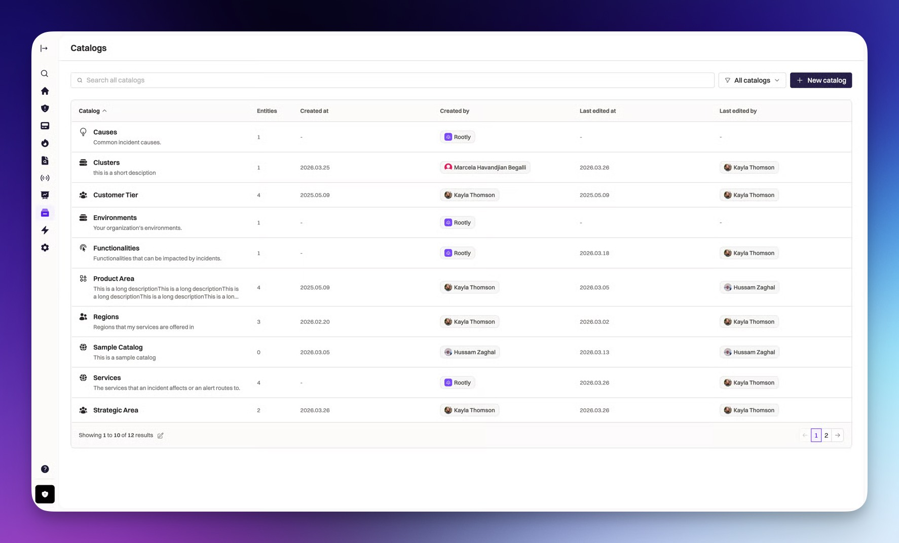

# rootly-catalog-sync

<p align="center">
  
</p>

A CLI tool that reconciles external sources of truth into [Rootly's Catalog](https://rootly.com), keeping services, teams, and metadata continuously in sync.

## Documentation

- **[Troubleshooting guide](docs/troubleshooting.md)** — common errors, diagnostics, and fixes
- **[Template syntax](docs/templates.md)** — Go template functions, missing keys, caching
- **Examples:**
  - [Simple (local YAML files)](docs/examples/simple/) — start here
  - [Backstage](docs/examples/backstage/) — sync from Backstage catalog
  - [GitHub](docs/examples/github/) — sync from GitHub org repositories
  - [Native Services](docs/examples/native-services/) — sync to native Rootly services

## Install

```bash
# Homebrew
brew install rootlyhq/tap/rootly-catalog-sync

# Go
go install github.com/rootlyhq/rootly-catalog-sync/cmd/rootly-catalog-sync@latest

# Docker
docker run --rm -e ROOTLY_API_KEY rootlyhq/rootly-catalog-sync sync --config=/config.yaml
```

## Quick Start

```bash
export ROOTLY_API_KEY=rootly_...

# Create a config (interactive wizard or sample file)
rootly-catalog-sync init

# Check your setup
rootly-catalog-sync doctor

# Preview what would change
rootly-catalog-sync plan

# Apply the plan
rootly-catalog-sync apply .rootly-catalog-sync-plan-Services.json

# Or plan + apply in one step
rootly-catalog-sync sync
```

## Authentication

Two methods, in priority order:

### API key (CI / non-interactive)

```bash
export ROOTLY_API_KEY=rootly_...
```

### OAuth 2.0 (interactive)

```bash
# Login via browser (Authorization Code + PKCE)
rootly-catalog-sync login

# Tokens saved to ~/.rootly-catalog-sync/config.yaml
# Auto-refreshed transparently

# Logout
rootly-catalog-sync logout
```

If `ROOTLY_API_KEY` is set, it takes precedence over OAuth tokens.

## Config

```yaml
version: 1
sync_id: services
pipelines:
  - sources:
      - local:
          files: ["catalog/*.yaml"]
    outputs:
      - catalog: "Services"
        external_id: "{{ .id }}"
        name: "{{ .name }}"
        fields:
          owner: "{{ .owner }}"
          tier: "{{ .tier }}"
```

Field mappings use Go templates. Built-in helpers: `{{ get .metadata "team" }}` for nested access, `{{ default .tier "unknown" }}` for fallbacks.

Config files are detected by extension: `.yaml`/`.yml` (default), `.jsonnet`, or `.hcl`. All three formats produce the same `Config` struct.

### Jsonnet config

Jsonnet adds variables, functions, and imports for DRY configs:

```jsonnet
// rootly-catalog-sync.jsonnet
{
  version: 1,
  sync_id: "services",
  pipelines: [
    {
      sources: [
        {
          github: {
            token: "$(GITHUB_TOKEN)",
            owner: "acme",
            repos: ["payments", "auth", "gateway"],
            files: ["catalog.yaml"],
          },
        },
      ],
      outputs: [
        {
          catalog: "Services",
          external_id: "{{ .id }}",
          name: "{{ .name }}",
          fields: {
            owner: "{{ .owner }}",
            tier: "{{ .tier }}",
          },
        },
      ],
    },
  ],
}
```

```bash
rootly-catalog-sync sync --config=rootly-catalog-sync.jsonnet
```

### HCL config

HCL provides Terraform-style syntax with blocks:

```hcl
# rootly-catalog-sync.hcl
version = 1
sync_id = "services"

pipeline {
  source {
    local {
      files = ["catalog/*.yaml"]
    }
  }
  output {
    catalog     = "Services"
    external_id = "{{ .id }}"
    name        = "{{ .name }}"
    fields = {
      owner = "{{ .owner }}"
      tier  = "{{ .tier }}"
    }
  }
}
```

```bash
rootly-catalog-sync sync --config=rootly-catalog-sync.hcl
```

### Sources

| Source | Description | Config key |
|--------|------------|------------|
| `inline` | Entries defined directly in config | `inline.entries` |
| `local` | YAML/JSON files from disk | `local.files` (glob) |
| `github` | Files from GitHub repositories | `github.owner`, `github.repos`, `github.files` |
| `exec` | Run a command, parse stdout | `exec.command`, `exec.args` |
| `backstage` | Backstage catalog API | `backstage.url`, `backstage.token` |
| `graphql` | Arbitrary GraphQL endpoint | `graphql.url`, `graphql.query`, `graphql.result` |
| `csv` | CSV files with header row | `csv.files`, `csv.delimiter` |
| `url` | Fetch YAML/JSON from remote URLs | `url.urls`, `url.headers` |
| `http` | Generic REST API with JSONPath extraction | `http.url`, `http.result`, `http.headers` |

#### GitHub source

```yaml
sources:
  - github:
      token: "$(GITHUB_TOKEN)"
      owner: acme
      repos: ["payments", "auth", "gateway"]  # or omit for all org repos
      files: ["catalog.yaml"]
      ref: main           # optional, defaults to repo default branch
      archived: false      # skip archived repos (default)
```

#### Exec source

```yaml
sources:
  - exec:
      command: bq
      args: ["query", "--format=json", "SELECT id, name, owner FROM services"]
```

#### Backstage source

```yaml
sources:
  - backstage:
      url: https://backstage.internal
      token: "$(BACKSTAGE_TOKEN)"
      kind: Component
```

#### GraphQL source

```yaml
sources:
  - graphql:
      url: https://api.internal/graphql
      query: "query($cursor: String) { services(after: $cursor) { nodes { id name } pageInfo { endCursor } } }"
      result: data.services.nodes
      headers:
        Authorization: "Bearer $(API_TOKEN)"
      paginate:
        mode: cursor
        cursor_path: data.services.pageInfo.endCursor
        page_size: 100
```

#### URL source

```yaml
sources:
  - url:
      urls:
        - https://internal.company.com/catalog/services.yaml
        - https://internal.company.com/catalog/teams.json
      headers:
        Authorization: "Bearer $(API_TOKEN)"
```

#### HTTP source

```yaml
sources:
  - http:
      url: https://api.internal.com/v1/services
      method: GET
      headers:
        Authorization: "Bearer $(API_TOKEN)"
      result: data.services
```

```yaml
# POST with body
sources:
  - http:
      url: https://api.internal.com/graphql
      method: POST
      body: '{"query": "{ services { id name owner } }"}'
      result: data.services
```

### Native resource targets

Sync directly to Rootly's native resources instead of custom catalog entities:

```yaml
outputs:
  - type: service           # service | functionality | environment | team
    external_id: "{{ .id }}"
    name: "{{ .name }}"
    fields:
      description: "{{ .description }}"
      pagerduty_id: "{{ .pagerduty_id }}"
```

| Type | API endpoint | Sentinel |
|------|-------------|----------|
| `service` | `/v1/services/bulk_upsert` | No |
| `functionality` | `/v1/functionalities/bulk_upsert` | No |
| `environment` | `/v1/environments/bulk_upsert` | ≥1 must remain |
| `team` | `/v1/teams/bulk_upsert` | ≥1 must remain |

When `type` is omitted or `"catalog"`, entities sync to custom catalogs (existing behavior). Native resources use the same `fields` map — known attributes (description, color, pagerduty_id, etc.) are set directly; everything else goes to catalog properties.

### Environment variables

Credentials can be injected via `$(ENV_VAR)` syntax in config files.

## Commands

### Core lifecycle

| Command | Description |
|---------|-------------|
| `plan` | Compute a diff and save a plan file |
| `apply <plan-file>` | Apply a saved plan |
| `sync` | Plan + apply in one step |
| `status [--fail-on-drift]` | Read-only drift check (exit 3 on drift) |

### Setup

| Command | Description |
|---------|-------------|
| `init` | Create a sample config file |
| `validate` | Check config syntax and schema |
| `doctor` | Verify env, auth, and API connectivity |
| `fmt` | Canonicalize config file formatting |
| `sources inspect` | Dump raw entries from sources before mapping |
| `explain <external_id>` | Trace one entry through source → mapping → diff |

### Operations

| Command | Description |
|---------|-------------|
| `import` | One-shot seed/migration (no external_id, no prune, no lock) |
| `adopt [--match=name]` | Claim existing UI entries under sync management |
| `watch [--interval=5m]` | Continuous reconcile loop (daemon mode) |
| `tui` | Interactive terminal UI for selective plan/apply |
| `login` | Authenticate via browser OAuth 2.0 (PKCE) |
| `logout` | Clear stored OAuth tokens |

### Flags

```
--config string          path to config file (default "rootly-catalog-sync.yaml")
--dry-run                compute and show changes without applying
--allow-prune            allow deletion of entries absent from source
--prune-threshold float  max prune ratio before safety abort (default 0.2)
```

## Interactive TUI

```bash
rootly-catalog-sync tui
```

An interactive terminal UI for reviewing and selectively applying changes:

- Browse changes color-coded by operation (create/update/delete)
- `space` to toggle individual changes, `a`/`n` to select all/none
- `enter` to expand field-level diffs
- `A` to apply only selected changes
- Confirmation prompt before any writes

## Safety

- **Deletes are opt-in** — `--allow-prune` required
- **Empty source aborts** — never wipes a catalog on a source failure
- **Prune ratio threshold** (default 20%) — aborts if too many deletes
- **Only synced entries are prunable** — entries without `external_id` (manual/UI) are never touched
- **Order: create/update first, delete last** — no window where entries are missing
- **Transactional batches** — bulk upsert is all-or-nothing per batch (max 100)

## CI Usage

### GitHub Actions

```yaml
name: Catalog Sync
on:
  push:
    branches: [main]
    paths: ["catalog/**"]

jobs:
  sync:
    runs-on: ubuntu-latest
    steps:
      - uses: actions/checkout@v4
      - run: go install github.com/rootlyhq/rootly-catalog-sync/cmd/rootly-catalog-sync@latest
      - run: rootly-catalog-sync sync
        env:
          ROOTLY_API_KEY: ${{ secrets.ROOTLY_API_KEY }}
```

### Dry-run on PRs

```yaml
- run: rootly-catalog-sync plan --dry-run
  env:
    ROOTLY_API_KEY: ${{ secrets.ROOTLY_API_KEY }}
```

### Drift detection (nightly)

```yaml
- run: rootly-catalog-sync status --fail-on-drift
  env:
    ROOTLY_API_KEY: ${{ secrets.ROOTLY_API_KEY }}
```

### Docker

```bash
docker run --rm \
  -e ROOTLY_API_KEY \
  -v $(pwd):/work \
  rootlyhq/rootly-catalog-sync \
  sync --config=/work/rootly-catalog-sync.yaml
```

Or in a CI pipeline:

```yaml
steps:
  - run: |
      docker run --rm \
        -e ROOTLY_API_KEY \
        -v ${{ github.workspace }}:/work \
        rootlyhq/rootly-catalog-sync \
        sync --config=/work/rootly-catalog-sync.yaml
```

### CircleCI

```yaml
version: 2.1

jobs:
  catalog-sync:
    docker:
      - image: cimg/go:1.23
    steps:
      - checkout
      - run:
          name: Install rootly-catalog-sync
          command: go install github.com/rootlyhq/rootly-catalog-sync/cmd/rootly-catalog-sync@latest
      - run:
          name: Sync catalog
          command: rootly-catalog-sync sync

workflows:
  catalog:
    jobs:
      - catalog-sync:
          filters:
            branches:
              only: main
```

For dry-run on PRs:

```yaml
jobs:
  catalog-preview:
    docker:
      - image: cimg/go:1.23
    steps:
      - checkout
      - run:
          name: Install rootly-catalog-sync
          command: go install github.com/rootlyhq/rootly-catalog-sync/cmd/rootly-catalog-sync@latest
      - run:
          name: Preview changes
          command: rootly-catalog-sync plan --dry-run
```

## Scenarios

| Scenario | Commands |
|----------|----------|
| First sync from files | `init` → `doctor` → `plan` → `apply` |
| CI on merge | `sync` |
| PR preview | `plan --dry-run` |
| Migrate UI-built catalog | `adopt --match=name` → `plan` → `apply` |
| Debug a change | `explain payments-api` |
| Nightly drift gate | `status --fail-on-drift` |
| Daemon mode | `watch --interval=5m` |
| Data warehouse source | `exec` source with `bq query` |
| Selective apply | `tui` → toggle changes → `A` |

## License

MIT
